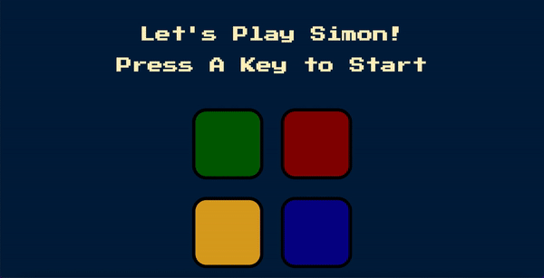

# Java Script Project: Simon-Game
## About
The goal of the project is to build a simple online game using JQuery frame-work.
The structure of the project made by HTML, designed with SCC and operated by Java-Script.

This project was made by Liav Shitrit.

## Game explention
Simon is a game of short-term memory skill invented by Ralph H. Baer and Howard J. Morrison, 
working for a toy design firm Marvin Glass and Associates, with software programming by Lenny Cope. 
The device creates a series of tones and lights and requires a user to repeat the sequence. 
If the user succeeds, the series becomes progressively longer and more complex.
https://en.wikipedia.org/wiki/Simon_(game)

## Source structure (Modules)
1. `game.js` - A script file responsible for the operation of the game and interaction with the user.
2. `index.html` - HTML file responsible for the game skeleton and the location of the game elements.
3. `styles.css` - A CSS file is responsible for the graphic design (UI) of the game (colors, shapes, etc.)

## Usage
open `index.html` with any browser.

## Game controls
The game is played using the mouse controller.

# Game sample

